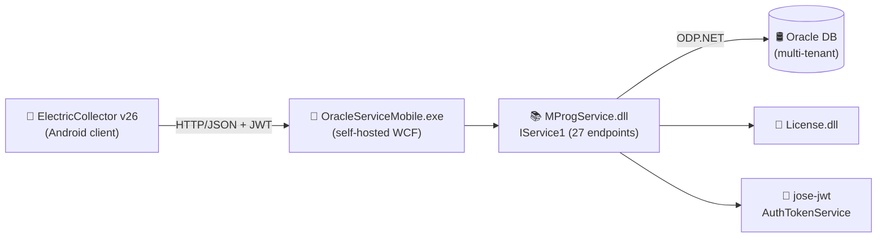

# 🔬 ElectricCollector28 — Reverse Engineering Lab

> **Purpose:** Forensic analysis lab for the legacy `ElectricCollector` Android +
> .NET WCF + Oracle system. All findings here feed the **AbbasiTahseel** React
> Native rewrite (`app1` main repo).
>
> **Role:** This repository is a *reference / documentation* repo. It contains
> **no production code** — only binaries, decompiled artifacts, and engineering
> documentation.

---

## 📦 What's inside

| Folder | Purpose |
|--------|---------|
| `binaries/`              | The 7 original binaries (read-only — never delete). |
| `analysis/`              | Final human-readable analysis (Markdown). |
| `reverse_engineering/`   | Raw decompiler output (IL, C#, JADX). |
| `schemas/`               | Inferred Oracle DB schema + ERD. |
| `api_contracts/`         | OpenAPI 3.0 + Postman + TypeScript types. |
| `for_main_repo/`         | Ready-to-copy artifacts for `app1`. |
| `tools/`                 | Reproducible shell / python scripts. |

Top-level documents:

- [`ANALYSIS_INDEX.md`](./ANALYSIS_INDEX.md) — master index of all findings.
- [`PROGRESS.md`](./PROGRESS.md)             — phase-by-phase progress tracker.

---

## 🧱 Binaries inventory

| File | Size | SHA-256 (first 16) | Role | RE priority |
|------|-----:|--------------------|------|:-----------:|
| `MProgService.dll`         | 135 KB | `45c7674b054d6ff1` | WCF `IService1` + 27 models — **the core** | 🔴 high |
| `OracleServiceMobile.exe`  | 67 KB  | `d92e3be49f53a0f8` | Windows Service host (self-hosted WCF) | 🔴 high |
| `License.dll`              | 15 KB  | `351502aa8052952f` | Licensing / activation | 🟠 medium |
| `ElectricCollector26.apk`  | 11 MB  | `70efb049884f6a56` | Android client v26 | 🔴 high |
| `jose-jwt.dll`             | 82 KB  | `5783e8ee909c0fb7` | OSS — JWT crypto (jose-jwt) | 🟢 low (OSS) |
| `Newtonsoft.Json.dll`      | 478 KB | `0516d4109263c126` | OSS — Json.NET | 🟢 low (OSS) |
| `Oracle.DataAccess.dll`    | 632 KB | `bec7aa3cca3a684a` | Oracle ODP.NET (vendor) | 🟢 low (vendor) |

Full hashes: see `binaries/SHA256SUMS.txt` (generated by `tools/01_setup_tools.sh`).

---

## 🏗️ High-level architecture (known so far)



- **WCF** is self-hosted by `OracleServiceMobile.exe` (a Windows Service).
- **Authentication** is JWT-based (`jose-jwt`), enforced by a
  `TokenValidationInspector` message inspector on the WCF dispatcher.
- **Multi-tenancy** is implemented via `Dictionary<int, string>
  ConnetionStrings` — different Oracle connection strings per tenant id.
- **Obfuscation:** the .NET assemblies were processed by **ConfuserEx** (we see
  `ConfusedByAttribute`). De-obfuscation is part of Phase 2.

---

## 🚀 How to reproduce the analysis

```bash
# 1. Install all tools (mono-utils, ilspycmd, jadx, apktool, python deps)
bash tools/01_setup_tools.sh

# 2. Dump IL from every .NET binary
bash tools/02_extract_il.sh

# 3. Decompile every DLL/EXE to C#
bash tools/03_decompile_dlls.sh

# 4. Decompile the APK
bash tools/04_decompile_apk.sh

# 5. (later phases) Generate TypeScript types from models
python3 tools/05_generate_typescript.py
```

Each script is **idempotent** — safe to re-run.

---

## 📜 License / legal

- All binaries in `binaries/` are **proprietary** to the original author
  (`AbbasiTahseel`).  Analysis happens here under a **good-faith
  reverse-engineering for interoperability** clause — the goal is to rebuild
  the same product in React Native for the same owner.
- Third-party OSS assemblies (`jose-jwt.dll`, `Newtonsoft.Json.dll`) and
  Oracle's `Oracle.DataAccess.dll` are kept **only as runtime references** —
  they are not re-analyzed beyond version identification.
- **No secrets, JWT signing keys, or full Oracle connection strings** will be
  committed in clear. When something sensitive surfaces, only the first
  4 characters are documented; full values stay in a secure offline note.

---

## 🧭 Where to start reading

1. [`analysis/00_OVERVIEW.md`](./analysis/00_OVERVIEW.md) — executive summary (updated each phase).
2. [`ANALYSIS_INDEX.md`](./ANALYSIS_INDEX.md) — full index.
3. [`for_main_repo/README.md`](./for_main_repo/README.md) — only thing the
   `app1` team needs to copy.
