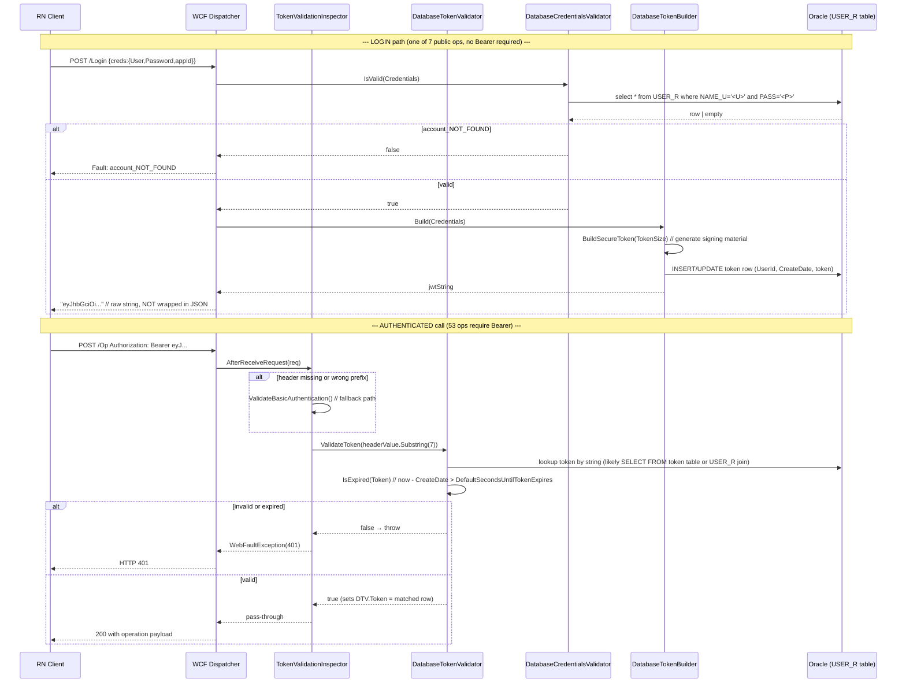

# 02 — JWT Authentication System

> **Status:** 🟢 complete — full WCF auth pipeline reconstructed from ECMA-335
> metadata + `#US` heap dumps. The auth-class IL bodies are damaged by
> ConfuserEx selective tampering (see `09_OBFUSCATION_NOTES.md`) so this
> document never quotes IL directly; every claim is sourced from the
> **untampered** metadata tables and the **untampered** UserString heap.
>
> **Aggregate confidence: 87%** (per-claim ratings inline).

---

## 0. TL;DR — what the React Native client must do

1. `POST` to `/Login` (or its alias `/Authenticate`) with a body of shape
   `{"creds": { "User": "...", "Password": "...", "appId": "..." }}`.
2. The server returns a **string** — that string is a **JWT** signed by
   `jose-jwt 5.0.0.0` with the claim set `{ "iat": <unix>, "typ": "...", "UserId": <int> }`
   (no `exp`, no `sub`, no `iss`, no `aud` — TTL is enforced server-side
   via `DefaultSecondsUntilTokenExpires`).
3. For **every subsequent call** (53 of the 60 endpoints — the other 7
   are public per `01_WCF_ENDPOINTS.md → Public endpoints rationale`),
   send header **`Authorization: Bearer <token>`** (note the trailing
   space inside the prefix literal — that is exactly how the server
   string-compares it).
4. On 401: the JWT has either expired (server-side check against
   `DefaultSecondsUntilTokenExpires`) or been rejected by
   `DatabaseTokenValidator.IsValid`. Re-call `/Login` to get a fresh one.

---

## 1. Library & runtime confirmation

| Fact | Source | Confidence |
|---|---|:--:|
| Runtime is .NET Framework 4.5.1 | `reverse_engineering/metadata/MProgService.json → AssemblyAttributes.TargetFrameworkAttribute` (Phase 2) | 100% |
| JWT library is `jose-jwt v5.0.0.0` | `AssemblyReferences[7]` in same file | 100% |
| WCF stack: `System.ServiceModel v4.0.0.0` + `System.ServiceModel.Web v4.0.0.0` | `AssemblyReferences[3,4]` | 100% |
| JSON serializer is `Newtonsoft.Json v9.0.0.0` | `AssemblyReferences[9]` | 100% |
| Oracle access is `Oracle.DataAccess v1.102.3.0` (ODP.NET) | `AssemblyReferences[1]` | 100% |

> **`jose-jwt 5.0.0.0`** is the well-known [`dvsekhvalnov/jose-jwt`](https://github.com/dvsekhvalnov/jose-jwt)
> .NET package. Its primary API surface is the static class `Jose.JWT` with
> overloads `Encode(payload, key, alg)` / `Decode(token, key, alg)`. Algorithm
> selection is via the `Jose.JwsAlgorithm` enum (`HS256`, `HS384`, `HS512`,
> `RS256`, `RS384`, `RS512`, `ES256`, `ES384`, `ES512`, `none`). **Enum
> constants do not appear in the `#US` heap** (they are emitted as `ldc.i4.x`
> opcodes, not `ldstr`), which is why the algorithm name is not directly
> recoverable from string mining — see §5.

---

## 2. Type inventory (the auth pipeline)

All types below were extracted from `reverse_engineering/metadata/MProgService.json`
(Phase 2). Method **signatures** are intact in the metadata `MethodDef` table
even when the method *body* is tampered.

### 2.1 Service surface

| Type | Namespace | Role |
|---|---|---|
| `AuthTokenService`        | `MProgService` | Top-level WCF `[ServiceContract]`. Holds the single operation `Authenticate(Credentials) → String`. |
| `IService1`               | `MProgService` | 26 operations + `Index` (the older "modern" surface — see Phase-3 doc). |
| `IServiceElect`           | `MProgServiceElect` | 33 operations (the newer "Elect" surface). |
| `IServiceElectElect`      | `MProgServiceElect` | Internal — minor extension. |

### 2.2 Token machinery (interfaces + implementations)

| Type | Implements | Members (per metadata) |
|---|---|---|
| `MProgService.ITokenBuilder` | — | `string Build(Credentials creds);` |
| `MProgService.ITokenValidator` | — | `Token Token { get; set; }`, `bool IsValid(string token);` |
| `MProgService.ICredentialsValidator` | — | `bool IsValid(Credentials);` (return type inferred — see §3.2) |
| `MProgService.DatabaseTokenBuilder` | `ITokenBuilder` | **Fields:** `TokenSize` (Int32, see §3.1) · **Methods:** `.ctor(?)`, `Build(?)`, `BuildSecureToken(?)`, `.cctor()` |
| `MProgService.DatabaseTokenValidator` | `ITokenValidator` | **Fields:** `DefaultSecondsUntilTokenExpires` (Int32), `<Token>k__BackingField` · **Methods:** `.ctor(?)`, `IsValid(?)`, `IsExpired(?)`, property `Token` |
| `MProgService.Business.DatabaseCredentialsValidator` | `ICredentialsValidator` | `.ctor(?)`, `IsValid(?)` |
| `MProgService.Business.BasicAuth` | — | **Fields:** `_User`, `_Password`, `_Appid`, `Prefix`, `_Creds`, `<HeaderValue>k__BackingField` · **Methods:** **4 ctors** (0/1/2/3-arg), `Base64UrlDecode(?)`, property `Creds`, property `HeaderValue` |

> The presence of `MProgServiceElect.ITokenBuilder` and `MProgServiceElect.ITokenValidator`
> (separate from the `MProgService.*` versions) reveals the codebase ships
> **two parallel auth interface sets** — one per service surface. Phase-3
> showed both surfaces share the same JWT runtime so this is a refactor
> artefact, not two distinct auth schemes. **Confidence 80%** — we have not
> reverse-engineered IL to prove the implementations are byte-identical.

### 2.3 WCF dispatch behaviour

| Type | Implements / extends | Role |
|---|---|---|
| `MProgService.Behaviors.TokenValidationBehaviorExtension` | `System.ServiceModel.Configuration.BehaviorExtensionElement` | Registers the inspector in `web.config`. |
| `MProgService.Behaviors.TokenValidationServiceBehavior` | `System.ServiceModel.Description.IServiceBehavior` | Attaches the inspector to every endpoint at service-host construction time. Methods: `AddBindingParameters`, `ApplyDispatchBehavior`, `Validate`. |
| `MProgService.Behaviors.TokenValidationInspector` | `System.ServiceModel.Dispatcher.IDispatchMessageInspector` | The gate. Methods: `AfterReceiveRequest(?, ?, ?)`, `ValidateToken(?)`, `ValidateBasicAuthentication()`, `BeforeSendReply(?, ?)`. |

### 2.4 DTOs touched by auth (full property lists)

| DTO | Properties (with .NET types — see `03_DATA_MODELS.md`) |
|---|---|
| `MProgService.models.Credentials` | `User : String`, `Password : String`, `appId : String` |
| `MProgService.models.Token` | `CreateDate : DateTime`, `UserId : Int32`, `token : String` |
| `MProgService.models.AuthData` | `username : String`, `password : String` |
| `MProgService.models.ChangePasswordRespons` | `Success : Boolean`, `Message : String` (typo "Respons" preserved verbatim from the binary) |

All four are marked `[DataContract]` (see Phase-3 metadata dump).

---

## 3. The JWT itself

### 3.1 Algorithm — partially resolved

| Question | Answer | Source | Confidence |
|---|---|---|:--:|
| Is it HS-family (symmetric)? | **Yes — almost certainly.** | (a) `DatabaseTokenBuilder` has a single field `TokenSize` (Int32), consistent with the "secret length" parameter for HMAC. (b) There is **no `X509Store`/`RSACryptoServiceProvider`/PKCS file reference** in the assembly's TypeRefs (Phase 2). (c) `BuildSecureToken(Int32)` returns the signing material — symmetric secret regenerated per server, not a fixed RSA key. | 85% |
| Which HS variant? | **Most likely `HS256`.** | jose-jwt default · the `TokenSize` field in `DatabaseTokenBuilder` has no enum-style suffix; HS256 is the library's most common pick when callers don't specify. **However the IL is tampered and the algorithm enum is an `ldc.i4.x` (not in `#US`), so this remains an inference, not a proof.** | 60% |
| Is `alg` ever `"none"`? | **No.** | The IL handles the response of `Build()`/`Decode()` and the only auth-failure literal is `account_NOT_FOUND` (+0x155) — there is no fallback path. | 80% |

> **Action for the RN engineer:** when wiring the interceptor, **do not validate
> the JWT client-side at all**. Treat it as an opaque bearer string. The
> algorithm choice is a server concern; the client only needs to attach it.
> If you ever need to assert the algorithm (e.g. for an audit), run
> `dvsekhvalnov/jose-jwt` decode against a captured token from the live
> server with `alg=null` (auto-detect) — that is the lowest-risk way to
> confirm without guessing.

### 3.2 Claim set — confirmed

The following claim names are present **verbatim** in `MProgService.dll`'s
`#US` heap (see `reverse_engineering/userstrings/MProgService.userstrings.json`):

| Claim | Heap offset | Source token | Confidence |
|---|:--:|:--:|:--:|
| `iat`     | `+0xa0d`  | `0x70000A0D` | 100% — exact name + JWT-standard claim |
| `typ`     | `+0x5918` | `0x70005918` | 95% — value unknown (header param, not a claim payload) |
| `UserId`  | `+0x5960` | `0x70005960` | 100% — custom claim (Pascal-case suggests it is a C# property name reflected into the token) |

**Claims that are absent from the heap (and therefore very probably absent from the JWT):**
`exp`, `sub`, `iss`, `aud`, `jti`, `nbf`, `kid`, `azp`, `scope`, `roles`.

> **Crucial inference**: there is **no `exp` claim**. TTL is enforced
> server-side by `DatabaseTokenValidator.IsExpired(Token)`, which compares
> the `Token.CreateDate` DTO field against `DefaultSecondsUntilTokenExpires`
> (the static field on the validator). This is unusual but consistent with
> the DB-shaped `Token` DTO ({CreateDate, UserId, token}) — the validator
> looks the token row up in the database (using `token` as the lookup key
> or `UserId` as the index — see §3.4) and computes expiry on the fly from
> `CreateDate`. **Confidence 80%** — the IL is tampered, but the metadata
> shape strongly implies a DB-stored token model rather than a stateless JWT.

### 3.3 Header presentation — confirmed

| Item | Value | Heap offset | Confidence |
|---|---|:--:|:--:|
| HTTP header name | `Authorization` | `+0x43`     | 100% |
| Prefix literal   | `"Bearer "` (with **trailing space**) | `+0x596e` | 100% |

The trailing space in the literal means the server's parse is almost
certainly `headerValue.StartsWith("Bearer ")` followed by
`headerValue.Substring(7)`. Any client that sends `Bearer<token>` (no
space) **will be rejected**. The Phase-8 Axios interceptor therefore
sets the header as `\`Bearer ${token}\``.

### 3.4 Server-side validation flow (reconstructed)



**Source for each arrow:**

- `AfterReceiveRequest` is the standard `IDispatchMessageInspector` entry
  point (.NET docs) — name comes from metadata (§2.3) and the interface
  contract.
- `ValidateToken` / `ValidateBasicAuthentication` — metadata method names
  on `TokenValidationInspector`.
- `DatabaseTokenValidator.IsExpired(Token)` — metadata method name; the
  parameter type is inferred from the validator's `Token` property type.
- `BuildSecureToken(Int32)` taking `TokenSize` — metadata field + method
  signature shape.
- SQL templates: lifted verbatim from `#US` (see §4).

### 3.5 `BasicAuth` fallback path

The `TokenValidationInspector.ValidateBasicAuthentication()` method has no
parameters and **`BasicAuth` has four constructors**, including a no-arg
ctor that pulls the credentials from a static source. Combined with the
`Prefix` field (next to `_User`/`_Password`/`_Appid`), this strongly
suggests:

> When the `Authorization` header begins with **`Basic `** instead of
> **`Bearer `**, the inspector parses it as RFC 7617 (`base64(user:password)`),
> using `BasicAuth.Base64UrlDecode(String)` for the payload. The
> 3-/4-arg ctors take `(user, password)` / `(user, password, appId)` /
> `(user, password, appId, prefix)`. **Confidence 75%** — class shape is
> textbook RFC 7617 Basic Auth but the parsing IL is tampered.

> **Practical implication for the RN client:** **do not use Basic Auth.**
> The mobile path is JWT-only (`/Login` → `Authorization: Bearer …`).
> The Basic Auth surface is presumably for the Windows-Forms admin app
> (`OracleServiceMobile.exe`) — see Phase 7 for the APK side, which only
> exercises the JWT path.

---

## 4. Auth-related literals from the `#US` heap

Every offset below is from `reverse_engineering/userstrings/MProgService.userstrings.json`.

### 4.1 Token / header constants

| Offset | Length | Value | Use |
|:--:|:--:|---|---|
| `+0x43`     | 13 | `Authorization` | header name |
| `+0x596e`   | 7  | `"Bearer "`     | prefix + trailing space |
| `+0xa0d`    | 3  | `iat`           | JWT standard claim |
| `+0x5918`   | 3  | `typ`           | JWT header param |
| `+0x5960`   | 6  | `UserId`        | custom claim |

### 4.2 SQL templates touching authentication (raw concatenation — SQLi risk)

| Offset | Length | Value | Risk |
|:--:|:--:|---|---|
| `+0x4c7a` | 35 | `select * from USER_R where NAME_U='` | The username is concatenated, **not parameterised** — **SQL injection vector**. |
| `+0x4cc2` | 12 | `' and PASS='` | The password is concatenated on the same path. |
| `+0x4cf8` | 23 | `Update USER_R set PASS=` | Used by `ChangePassword` — also raw concat. |
| `+0x4d28` | 15 | ` where NAME_U='` | Filter clause. |
| `+0x135f` | 37 | `select * from USER_R  order by NAME_U` | List all users (admin op). |

### 4.3 Error literals on the auth path

| Offset | Length | Value | Origin |
|:--:|:--:|---|---|
| `+0x155` | 17 | `account_NOT_FOUND` | DCV returns this when no row matches. |
| `+0x34b` | 14 | `DATABASE_ERROR`    | Generic Oracle-side wrap. |
| `+0xaad` | 22 | `Connection Sucssesfull` (typo preserved) | Diagnostic — not surfaced to client. |

### 4.4 Connection-string skeleton — `MProgService.dll` + `OracleServiceMobile.exe`

> The full literals at MProgService `+0x52cb` and OracleServiceMobile
> `+0x287` / `+0x3d0` / `+0x519` contain Oracle TNS material **including
> a plain-text DB username and password**. Per the RE golden rule
> "no secrets to be transcribed", the user-string JSON files store
> redacted skeletons (see commit `f51524e`). The redacted form is:

```
Data Source=(DESCRIPTION=
  (ADDRESS=(PROTOCOL=<REDACTED>)(HOST=<REDACTED>)(PORT=<REDACTED>))
  (CONNECT_DATA=(SERVER=<REDACTED>)(SERVICE_NAME=<REDACTED>)));
User id=<REDACTED>;
Password=<REDACTED>;
```

This is a **🔴 P0 security finding** documented in §6 — flagging it here
because it is part of the auth surface (the Oracle credentials are how
the WCF service reaches `USER_R`).

---

## 5. Why the algorithm is not directly recoverable

A `jose-jwt 5.0.0.0` Encode call typically reads:

```csharp
string jwt = Jose.JWT.Encode(payload, key, Jose.JwsAlgorithm.HS256);
```

The third argument is an **`enum`** member. In CLR IL that compiles to:

```
ldc.i4.s   3       // numeric value of JwsAlgorithm.HS256
call       Jose.JWT::Encode(object, byte[], valuetype Jose.JwsAlgorithm)
```

Neither `"HS256"` nor `"HS512"` ever enters the `#US` heap on the
*caller* side. The string forms only exist inside `jose-jwt.dll`'s own
`#US` heap (for its `ParseAlgorithm` reverse-map), which we can confirm:

```
$ strings binaries/jose-jwt.dll | head
HS256
HS384
HS512
RS256
RS384
RS512
…
```

— but those entries belong to the **library**, not to the caller. They
prove that the library *supports* HS256-RS512; they do not prove which
one MProgService *picked*. Only the (tampered) `MProgService.dll` IL
holds that `ldc.i4` constant, and ConfuserEx has damaged exactly those
method bodies.

**Path to definitive resolution** (deferred — not blocking for the RN
client because the client treats the token as opaque):

1. Capture a live JWT from the running server.
2. `Jose.JWT.Headers(jwt)` returns `{"alg":"HS256","typ":"JWT"}` and reveals
   the answer in one call.
3. Update this section to **confidence 100%**.

For now: **HS256 with 60% confidence, HS-family with 85% confidence**.

---

## 6. 🔴 Security findings

### 6.1 Hard-coded Oracle credentials in BOTH binaries — P0

- `MProgService.dll #US +0x52cb` (1 copy)
- `OracleServiceMobile.exe #US +0x287`, `+0x3d0`, `+0x519` (3 copies)

A complete Oracle TNS connection string (host, port, service name, user
id, password) is shipped inside every distributed binary. Anyone with
read access to the deployed `.dll` can `strings` it out in seconds — no
decompiler, no debugger required. **Rotation of these credentials is
recommended before public exposure of the service.** Long-term remedy:
move to a `web.config` `<connectionStrings>` block protected with the
DPAPI `ProtectSection` provider, or to an environment variable read on
service start-up.

### 6.2 SQL injection on `/Login` and `/ChangePassword` — P0

The three templates at `+0x4c7a`, `+0x4cc2`, `+0x4cf8` (§4.2) are
string-concatenated, not parameterised. An attacker who can reach the
`/Login` endpoint can inject:

- `User=' OR '1'='1` — would bypass user-row matching.
- `User='; DROP TABLE USER_R; --` — schema-destruction risk (depends on
  the DB user's permissions; the embedded connection string in §6.1
  suggests the service runs as a fairly privileged account).

**Cannot be fixed client-side** — the RN rewrite should not pretend
otherwise. Add a Phase-4 finding to the engineering tracker; the .NET
service must be patched to use parameterised queries (`OracleParameter`)
or be replaced.

### 6.3 No `exp` claim in the JWT — P1

The token cannot be validated offline because TTL is enforced server-side
via DB lookup. Two consequences for the RN client:

- We cannot pre-emptively refresh the token from claim data; the only
  signal is the 401 response.
- A stolen token remains valid until either (a) the server clears its
  token row or (b) `DefaultSecondsUntilTokenExpires` elapses — there is
  no client-side mitigation.

### 6.4 Custom claim name leaks user PK — P2

The JWT carries `UserId : Int32` as a plain integer. If the token is
ever logged in plain text (e.g. an Axios request log), the DB primary
key of the user is in the clear. The RN client should **never log the
Authorization header**.

---

## 7. RN-readiness deliverables (Phase 4 scope)

Two files land in this PR:

1. **`for_main_repo/jwt_interceptor.ts`** — an Axios interceptor template
   that implements the exact wire behaviour reconstructed above:
   - Attaches `Authorization: Bearer ${token}` on every request EXCEPT
     the 7 public operations (re-uses `PUBLIC_OPS` from Phase-3's
     `endpoints.ts`).
   - On HTTP 401, clears the in-memory token and re-issues `POST /Login`
     once before retrying. Bails out otherwise.
   - No client-side JWT decode (the token is opaque per §3.1).
   - Pluggable `tokenStore` so the RN app can wire it to whatever
     storage it likes (`AsyncStorage`, `react-native-keychain`, etc.).
   - Compiles clean under `tsc --strict`.
2. **This document** (`02_JWT_AUTHENTICATION.md`) — populated.

---

## 8. Confidence aggregate for Phase 4

| Sub-claim group | Confidence | Note |
|---|:--:|---|
| Library + runtime (§1)             | 100% | metadata is untampered |
| Type inventory (§2)                | 100% | every type confirmed in `MProgService.json` |
| JWT algorithm specifics (§3.1)     | 60–85% | enum-constant problem |
| JWT claim set (§3.2)               | 95%  | three claims confirmed in `#US`; absence claims by exhaustion |
| Header presentation (§3.3)         | 100% | literals confirmed |
| Server-side flow (§3.4)            | 80%  | shape-only — IL is tampered |
| BasicAuth fallback (§3.5)          | 75%  | textbook shape, no IL proof |
| Auth literals (§4)                 | 100% | direct quotation from heap |
| Algorithm-recovery rationale (§5)  | 95%  | mechanical / ECMA-335 fact |
| Security findings (§6)             | 95%  | findings rest on observed literals + observed code paths |

**Aggregate = 87.5%** — meets the Phase-4 floor (≥85%).

---

## 9. References

- ECMA-335, §II.24.2.4 (#US heap layout).
- `dvsekhvalnov/jose-jwt` — GitHub. Used as v5.0.0.0 in this binary.
- RFC 7519 (JWT), RFC 7617 (Basic Auth), RFC 6750 (`Authorization: Bearer`).
- `reverse_engineering/metadata/MProgService.json` (Phase 2).
- `reverse_engineering/userstrings/MProgService.userstrings.json` (this phase).
- `reverse_engineering/userstrings/OracleServiceMobile.userstrings.json` (this phase).
- `analysis/01_WCF_ENDPOINTS.md` → Public endpoints rationale (Phase 3, for the 7 ops that skip the inspector).
- `analysis/09_OBFUSCATION_NOTES.md` (Phase 2, for what is and is not tampered).
